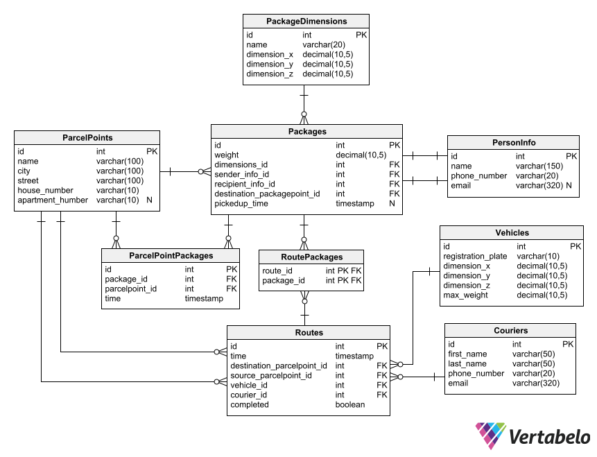

<h1>Aplikacja dla firmy kurierskiej    </h1>
Schemat bazy danych:

<h2>Skład grupy :  </h2>
Patryk Czuchnowski (patczuch@student.agh.edu.pl)  
Andrzej Wacławik (wajarema@student.agh.edu.pl)  
Michał Pędrak (michalpedrak@student.agh.edu.pl)  

<h2>Technologie :  </h2>
Baza - PostgreSQL  
Frontend - React  
Backend - Python, Flask
