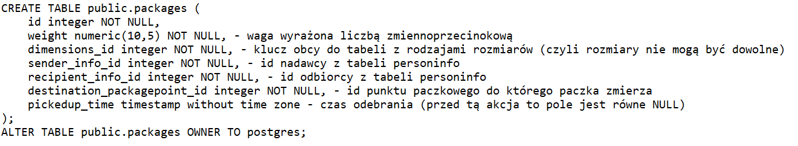
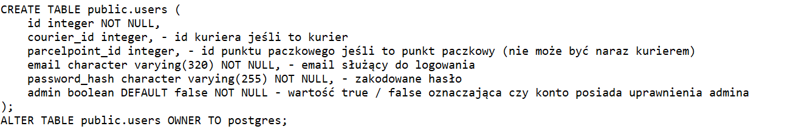
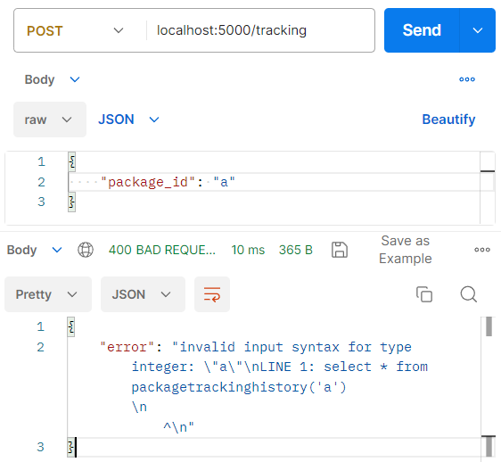

<h1>Aplikacja dla firmy kurierskiej</h1>

## Skład grupy
Patryk Czuchnowski (patczuch@student.agh.edu.pl)  
Andrzej Wacławik (wajarema@student.agh.edu.pl)  
Michał Pędrak (michalpedrak@student.agh.edu.pl)  

## Technologie
Baza danych - PostgreSQL  
Backend - Python, Flask   
Frontend - React

## Charakterystyka
W ramach projektu chcielibyśmy stworzyć stronę internetową dla firmy kurierskiej oferującej usługi dostarczania paczek pomiędzy punktami paczkowymi. Klient przynosi paczkę do takiego punktu, następnie pracownik dodaje informacje o niej do bazy i podaje klientowi numer paczki. Pod koniec dnia pracownik tworzy trasy dla kurierów, którzy wypełniają trasę, a następnie potwierdzają jej ukończenie w aplikacji. Gdy paczka znajdzie się w punkcie docelowym, odbiorca może przyjść ją odebrać co również zapisuje pracownik w aplikacji. Trasę paczki można kontrolować przez cały czas trwania dostawy mając jej numer.

## Problemy do uwzględnienia
Aby stworzyć trasę do przewozu paczek musi być spełnione wiele warunków takich jak nie przekroczenie maksymalnej ładowności pojazdu, fizyczna obecność paczek w punkcie startowym czy możliwość uczestniczenia danego kuriera w tym czasie. Widok całej drogi paczki musi uwględniać wszystkie punkty paczkowe oraz trasy w których ta paczka była obecna.

## Funkcje dostępne dla użytkowników
### Każdy użytkownik

1. Śledzenie przesyłek  

2. Logowanie  

3. Rejestracja  

### Pracownik punktu
1. Zarejestrowanie nowej przesyłki  

2. Wyświetlenie przesyłek w punkcie  
3. Potwierdzenie odebrania przesyłki  

4. Utworzenie trasy dla kuriera  

### Kurier
1. Wyświetlenie tras  
2. Potwierdzenie odbycia trasy  

### Admin
1. Dodanie kuriera
2. Dodanie punktu paczkowego
3. Dodanie pojazdu
4. Nadanie kontom uprawnień
## Schemat bazy danych

## Szczegółowy opis kluczowych tabel
1. tabela packages     
2. tabela routes     
3. tabela users     
4. tabela routepackages     
5. tabela parcelpointpackages     

## Funkcje SQL
1. [Dodanie kuriera](./sql/functions/AddCourier.sql) 
2. [Dodanie rozmiaru paczki](./sql/functions/AddPackageDimension.sql) 
3. [Dodanie punktu paczkowego](./sql/functions/AddParcelPoint.sql) 
4. [Dodanie wehikułu](./sql/functions/AddVehicle.sql) 
5. [Zarejestrowanie nowej paczki](./sql/functions/RegisterPackage.sql)   
  
6. [Potwierdzenie odebrania paczki](./sql/functions/PickUpPackage.sql) 
7. [Lista paczek w punkcie](./sql/functions/GetContentsOfParcelPoint.sql)   
  
8. [Lokalizacja paczki](./sql/functions/PackageLocation.sql) 
9. [Historia podróży paczki](./sql/functions/PackageTrackingHistory.sql)   
  
10. [Dodanie trasy przewozowej](./sql/functions/AddRoute.sql)   
   
12. [Potwierdzenie odbycia trasy](./sql/functions/CompleteRoute.sql)   
  
12. [Zaktualizowanie uprawnień użytkownika](./sql/functions/UpdateUserPrivileges.sql)   

## Backend
Backend naszego projektu został wykonany w Pythonie przy pomocy frameworka Flask. We Flasku każdy endpoint jest funkcją poprzedzoną odpowiednimi adnotacjami, zwracającą krotkę (odpowiedź, kod odpowiedzi HTTP). Do porozumienia z bazą PostgreSQL korzystaliśmy również z biblioteki psycopg2. Kod źródłowy wszystkich endpointów znajduje się w pliku [app.py](./back_end/app.py).

### Dostępne endpointy
Przed stworzeniem endpointów musimy zainicjalizować aplikację:
   
1. Logowanie  
Adres: {{baseUrl}}/login, metoda: POST
2. Rejestracja  
Adres: {{baseUrl}}/register, metoda: POST
3. Śledzenie przesyłki  
Adres: {{baseUrl}}/tracking, metoda: POST  
  
 Przykładowe zapytanie w Postmanie zakończone sukcesem:
  
 Przykładowe błędne zapytanie w Postmanie (id paczki niebędące integerem):
  
4. Wymiary przesyłek  
Adres: {{baseUrl}}/package_dimensions, metoda: GET
5. Punkty paczkowe  
Adres: {{baseUrl}}/parcelpoints, metoda: GET
6. Pojazdy  
Adres: {{baseUrl}}/vehicles, metoda: GET
7. Kurierzy  
Adres: {{baseUrl}}/couriers, metoda: GET
8. Nowa paczka  
Adres: {{baseUrl}}/new_package, metoda: POST  
  
 W celu prawidłowego wykonania zapytania w zakładce Headers w Postmanie musimy dołączyć token autoryzacji:
  
 Przykładowe zapytanie w Postmanie zakończone sukcesem:
  
 Przykładowe błędne zapytanie w Postmanie (ujemna waga):
  
9. Nowa trasa  
Adres: {{baseUrl}}/create_route, metoda: POST  
  
 W celu prawidłowego wykonania zapytania w zakładce Headers w Postmanie musimy dołączyć token autoryzacji:
  
 Przykładowe zapytanie w Postmanie zakończone sukcesem:
  
 Przykładowe błędne zapytanie w Postmanie (za duża waga paczek dla tego pojazdu):
  
10. Potwierdzenie odebrania paczki  
Adres: {{baseUrl}}/pickup_package, metoda: POST
11. Przesyłki w punkcie  
Adres: {{baseUrl}}/parcelpoint_packages, metoda: POST  
  
 Funkcja pomocnicza zwracająca informacje o paczce (nie jest endpointem):
  
 W celu prawidłowego wykonania zapytania w zakładce Headers w Postmanie musimy dołączyć token autoryzacji:
  
 Przykładowe zapytanie w Postmanie zakończone sukcesem (nie jest potrzebne body zapytania, ponieważ id punktu paczkowego jest odczytywane z tokenu autoryzacji):
  
 Przykładowe błędne zapytanie w Postmanie (brak tokenu autoryzacji):
  
12. Trasy  
Adres: {{baseUrl}}/routes, metoda: POST
13. Potwierdzenie ukończenia trasy  
Adres: {{baseUrl}}/finish_route, metoda: POST  
  
 W celu prawidłowego wykonania zapytania w zakładce Headers w Postmanie musimy dołączyć token autoryzacji:
  
 Przykładowe zapytanie w Postmanie zakończone sukcesem:
  
 Przykładowe błędne zapytanie w Postmanie (trasa już zakończona):
  
14. Nowy kurier  
Adres: {{baseUrl}}/new_courier, metoda: POST
15. Nowy punkt paczkowy  
Adres: {{baseUrl}}/new_parcelpoint, metoda: POST
16. Nowy samochód  
Adres: {{baseUrl}}/new_vehicle, metoda: POST
17. Nadanie uprawnień kontom  
Adres: {{baseUrl}}/set_permissions, metoda: POST

## Wnioski
Tworząc nasz projekt zdecydowaliśmy się, że większość pracy będzie wykonywana w procedurach SQL, a endpointy będą dość lekkie i będą służyły głownie do wykonywania tych procedur. Uważamy, że była to dobra decyzja. Pisanie wszystkiego w endpointach byłoby trudniejsze i wymagałoby problematycznej obsługi dużej liczby potencjalnych błędów. Ograniczenie ilości zapytań do bazy danych może także poprawić wydajność serwera. Uważamy również, że takie rozwiązanie jest bardziej uporządkowane - to co związane z bazą zostaje w bazie.

## Do poprawy lub uzupełnienia (27 kwietnia 2023)
- ~~przedstawić opis problemu na początku README~~ 
- ~~zastanowić się nad podejściem do przechowywania danych w PersonInfo~~ 
- ~~dodać spis (listę) funkcji (np. z linkami do kodu)~~ 
- ~~dodawać komentarze do kodu sql~~ 
- ~~opisać kluczowe tabele i funkcje (ale jak coś jest oczywiste to nie mieszać)~~ 
- ~~dokumentacja w jednym pliku (w miarę liniowa - bez linków itp.)~~ 
- ~~zarysować architekturę backendu (Python + Flask) w dokumentacji~~ 
- ~~testy do backendu w Postman'ie~~ 
- ~~wnioski czy to dobrze ze zrobilismy tak ze procedury sa w postgresie i tylko je wywolujemy przez backend~~
